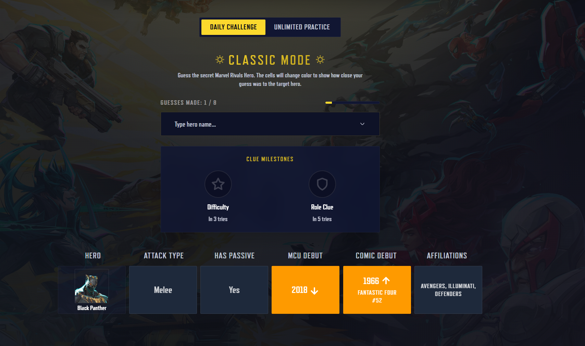
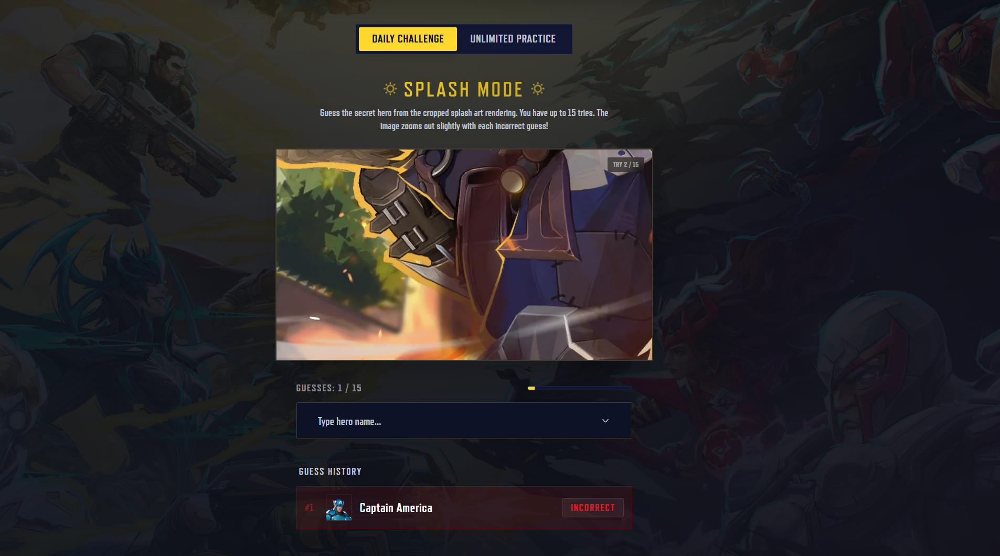
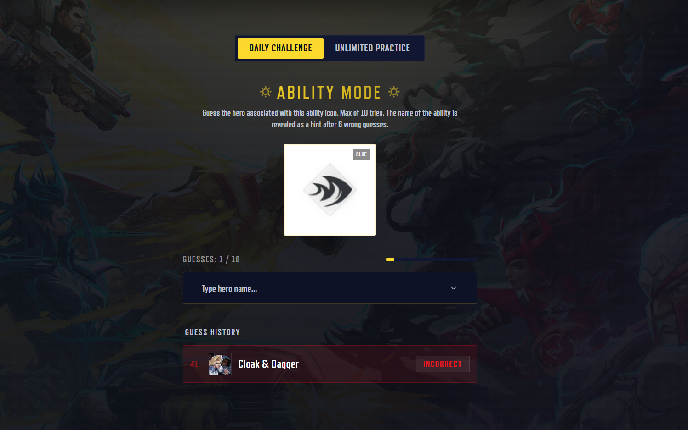
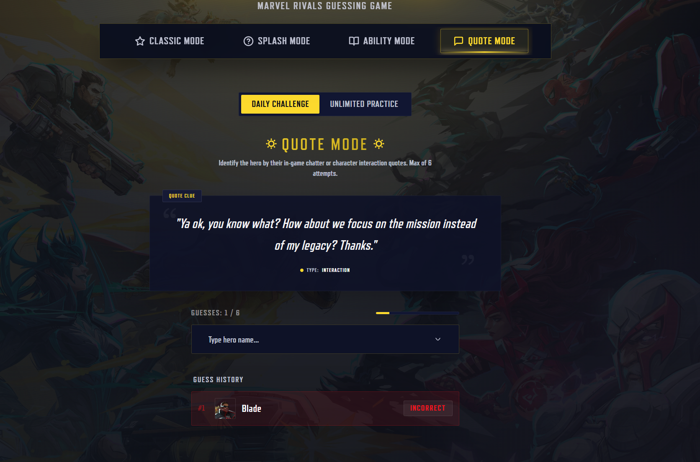

# Rivaled - Marvel Rivals Guessing Game

🎮 **Live Demo:** [Click here](https://rivaled-app.vercel.app/)

**Rivaled** is a premium, fan-made guessing game inspired by LoLdle.net, built specifically for the **Marvel Rivals** universe. Test your knowledge of Earth's Mightiest Heroes across four distinct game modes featuring custom themes, animations, audio synthesis, and stats tracking.

---

## 🎮 Game Modes

### 1. Classic Mode
Guess the secret hero. With each guess, you receive color-coded feedback based on hero attributes:
*   **Green:** Perfect match.
*   **Yellow:** Partial match (e.g., matching one of multiple affiliations).
*   **Red:** No match.

---

### 2. Splash Mode
Identify the hero from a cropped and zoomed-in section of their splash art. 
*   The camera slowly zooms out with each incorrect guess to reveal more context.
*   **Bonus Challenge:** Once you guess the hero, try to guess the exact name of the skin shown!

---

### 3. Ability Mode
Guess the hero based solely on a specific ability icon.
*   If you get stuck, the ability name is revealed as a hint after 6 attempts.
*   **Bonus Challenge:** Guess the correct keybind/button mapping for the ability (e.g., *Left Click, Shift, Q*).

---

### 4. Quote Mode
Guess the hero from their in-game voice lines and quotes.
*   **Clue Anonymization:** Quotes are cleaned of speaker prefixes, and the clue context (like ability triggers or recipient heroes) is anonymized to prevent revealing the hero's name.

Q

---

## ⚡ Key Features

*   **Daily Challenges & Unlimited Practice:** Play the unified Daily game (same target for everyone, resets at midnight) or run Unlimited mode for endless training.

*   **Global Statistics Tracker:** Track your games played, win rate, current/max streaks, and guess distribution for each mode (saved to local storage).

*   **Interactive Audio:** Synthesized interface clicks, success/failure tones, and sound cues with a global mute toggle.

---

---

## 📜 Disclaimer
Rivaled is a fan-made project. It is not affiliated with, endorsed by, or associated with NetEase Games or Marvel Games. All hero images, logos, abilities, and quotes are property of their respective creators.
